# The <tt>grow</tt> Method

The grow method is one of the basic methods for describing a process. It is called on a mask data object. The basic use case is:

```ruby
l1 = layer("1/0")
metal = mask(l1).grow(0.3)
output("1/0", metal)
```

This simple case deposits a material where the layer is drawn with a rectangular profile. 

The grow method has up to two arguments and a couple of options which have to be put after the arguments in the usual Ruby fashion, using the notation ":name => value":

<tt>grow(<i>height</i>, <i>lateral</i>, <i>options ...</i>)</tt>

The height argument is mandatory and specifies the thickness of the layer grown. The lateral parameter specifies the lateral extension (overgrow, diffusion). The lateral extension is optional and defaults to 0. The lateral extension can be negative. In that case, the profile will be aligned with the mask at the bottom. Otherwise it is aligned at the top.

There are several options:

| Option | Value       |
| ------ | ----------- |
| :mode  | The profile mode. Can be :round, :square and :octagon. The default is :square. |
| :taper | The taper angle. This option specifies tapered mode and cannot be combined with :mode. |
| :bias  | Adjusts the profile by shifting it to the interior of the figure. Positive values will reduce the line width by twice the value. |
| :on    | A material or an array of materials onto which the material is deposited (selective grow). The default is "all". This option cannot be combined with ":into". With ":into", ":through" has the same effect than ":on". |
| :into  | Specifies a material or an array of materials that the new material should consume instead of growing upwards. This will make "grow" a "conversion" process like an implant step. |
| :through | To be used together with ":into". Specifies a material or an array of materials to be used for selecting grow. Grow will happen starting on the interface of that material with air, pass through the "through" material (hence the name) and consume and convert the ":into" material below. |
| :buried | Applies the conversion of material at the given depth below the mask level. This is intended to be used together with :into and allows modeling of deep implants. The value is the depth below the surface. |

## <tt>:mode</tt>, <tt>:taper</tt> and <tt>:bias</tt> 

The effect of the mode and bias interaction is best illustrated with some examples.

The initial layout is always this in all following examples:


The first example if the effect of the plain grow with a thickness of 0.3. It will deposit a rectangular material profile at the mask:

```ruby
grow(0.3)
```

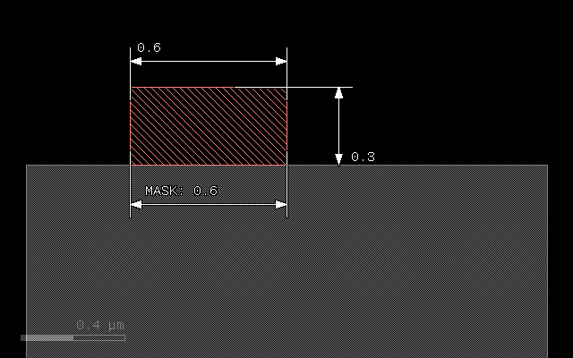

The next example illustrates the effect of a lateral extension on a square profile. The 0.1 extension will add material left and right of the main patch:

```ruby
grow(0.3, 0.1)
```


In "round" mode, the material will be deposited with an elliptical profile. The vertical axis will be 0.3, the horizontal 0.1 representing the laternal extension. The patch will become bigger than the mask by the lateral extension at the bottom:

```ruby
grow(0.3, 0.1, :mode => :round)
```

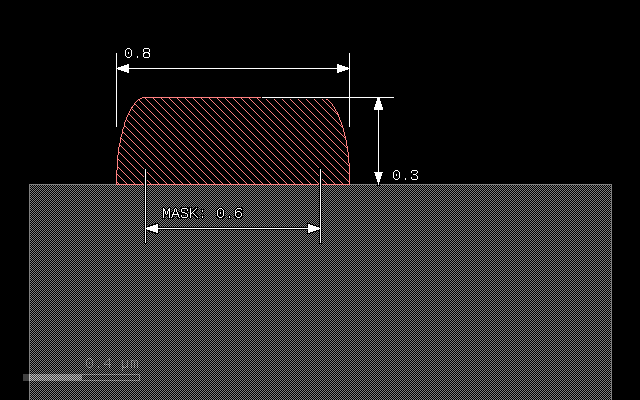

To avoid overgrow, a negative lateral extension can be specified, resulting in a alignment of patch and mask at the bottom:

```ruby
grow(0.3, -0.1, :mode => :round)
```

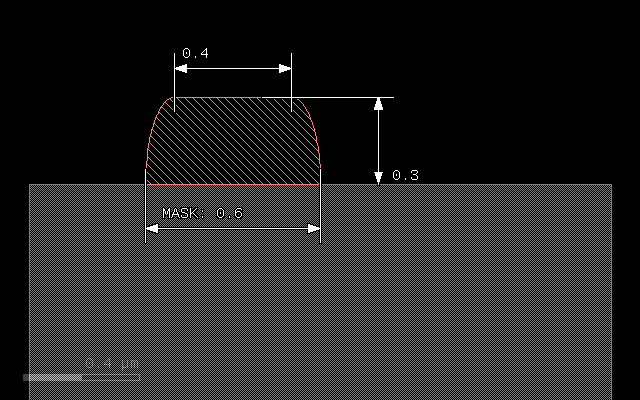

Another mode is "octagon" which is basically a coarse approximation of the ellipse and computationally less expensive:

```ruby
grow(0.3, 0.1, :mode => :octagon)
```


A bias value can be specified to fine-tune the position of the bottom edge of the patch. A *positive* bias value will *shrink* the figure:

```ruby
grow(0.3, 0.1, :mode => :round, :bias => 0.05)
```

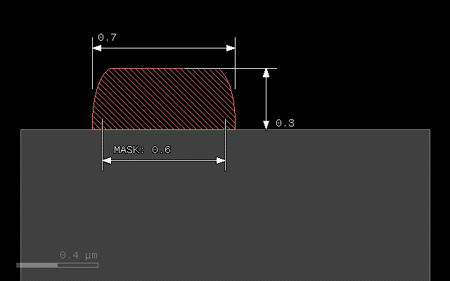

A special profile can be specified with the :taper option. This option specifies a taper angle and a conical patch will be created. The taper angle will be the sidewall angle of the patch. This option cannot be combined with :mode and the lateral extension should be omitted. It can be combined with :bias however:

```ruby
grow(0.3, :taper => 10)
```

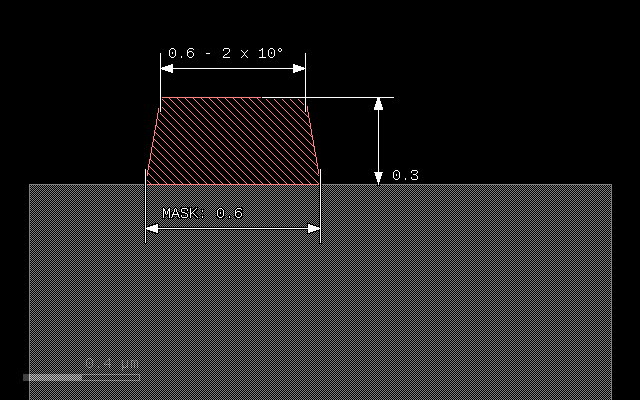

```ruby
grow(0.3, :taper => 10, :bias => -0.1)
```

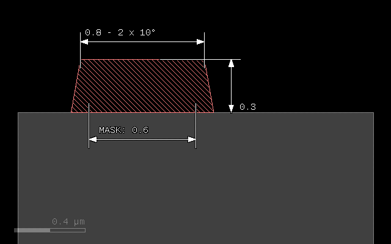

## Step coverage

The following image shows the step coverage of a 30° slope and a vertical step by a material deposited in round mode with thickness of 0.3 and lateral extension of 0.1. The sidewall of the step will be covered with a thickness of 0.1 corresponding to the lateral extension:

```ruby
grow(0.3, 0.1, :mode => :round)
```

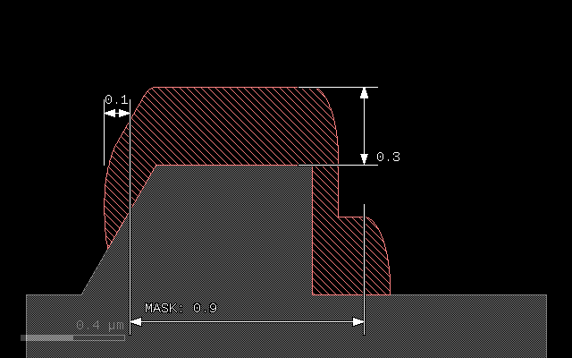

## <tt>:on</tt> - growing on specific material

The :on option allows to select growth on a material surface in addition to selection by a mask. To do so, specify the array of materials or the single material on which the new material will be deposited. The surface of these substrate materials will form the seed of the growth process.

An array of materials is written as a list of material data objects in square brackets.

```ruby
# Prepare input layers
m1 = layer("1/0")
m2 = layer("2/0")

# Grow a stop layer
stop = mask(m2).grow(0.05)

# Grow with mask m1, but only where there is a substrate surface
metal = mask(m1).grow(0.3, 0.1, :mode => :round, :on => bulk)

# output the material data to the target layout
output("0/0", bulk)
output("1/0", metal)
output("2/0", stop)
```

Here is the input data:

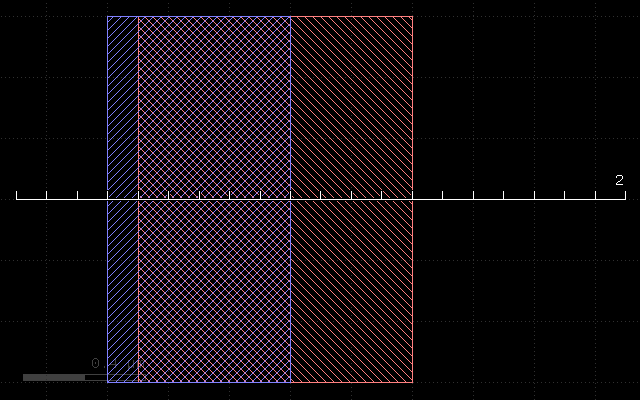

And this is the result:

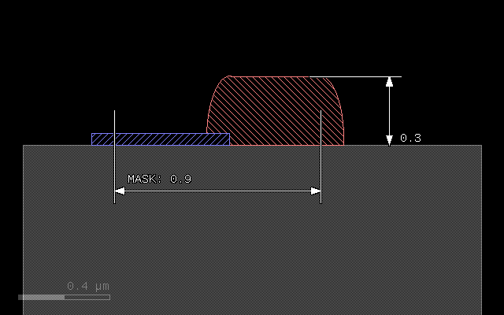


## <tt>:into</tt> - converting material

With the "into" options it is possible to convert material below the mask rather than growing upwards. "into" specifies a single material or an array of materials in sqaure brackets. In effect, the direction is reversed and the material given by "into" is consumed and replaced by the new material. Note: the "etch" operation is basically doing the same, replacing the material by "air".

```ruby
# Prepare input layers
m1 = layer("1/0")
m2 = layer("2/0")

substrate = bulk

# Grow with mask m1 into the substrate
metal = mask(m1).grow(0.3, 0.1, :mode => :round, :into => substrate)

# output the material data to the target layout
output("0/0", substrate)
output("1/0", metal)
```

This script gives the following result:

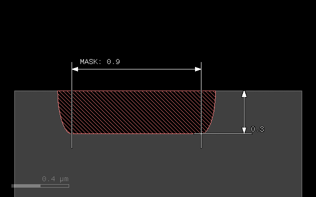

## <tt>:through</tt> - selective conversion

The same way that "on" will make the grow selective on the chosen materials, "through" will select seed materials for conversion with ":into". Conversion will start at the interface between "through" and air and consume the materials of ":into". It will not consume the "through" materials:

```ruby
# Prepare input layers
m1 = layer("1/0")
m2 = layer("2/0")

substrate = bulk

stop = mask(m2).grow(0.05, :into => substrate)

# Grow with mask m1 into the substrate
metal = mask(m1).grow(0.3, 0.1, :mode => :round, :through => stop, :into => substrate)

# output the material data to the target layout
output("0/0", substrate)
output("1/0", metal)
output("2/0", stop)
```

With the following input:

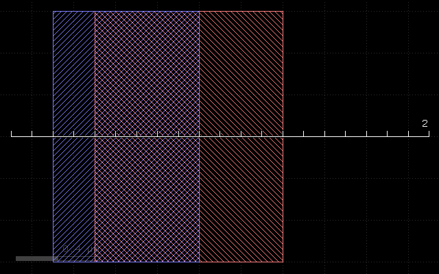

This script gives the following result:

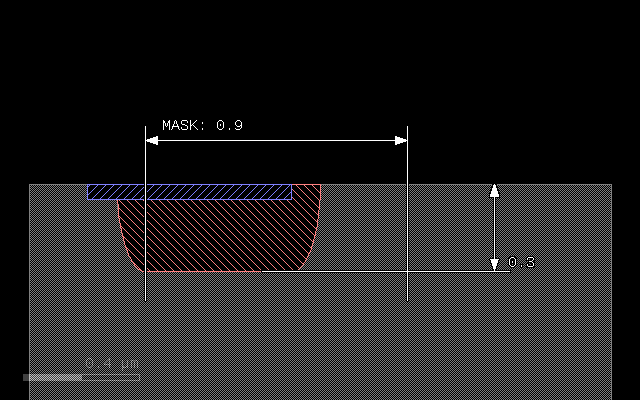

## <tt>:buried</tt> - applies a conversion in a region below the surface

If that parameter is given, the process is not applied on the surface, but at the given depth below the surface. The main application is to model deep implants. In that case, :into can be given to specify the material to convert and :buried will specify the depth at which the material is converted. The region of cenversion extends below and above that depth:

```ruby
# Prepare input layers
m1 = layer("1/0")
m2 = layer("2/0")

substrate = bulk

# Grow with mask m1 into the substrate
metal = mask(m1).grow(0.3, 0.1, :mode => :round, :into => substrate, :buried => 0.4)

# output the material data to the target layout
output("0/0", substrate)
output("1/0", metal)
```

With the following input:


This script gives the following result:

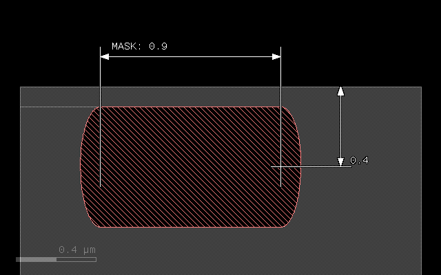

