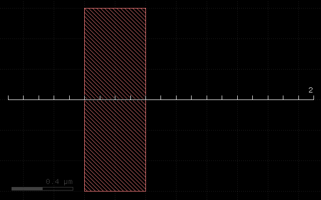
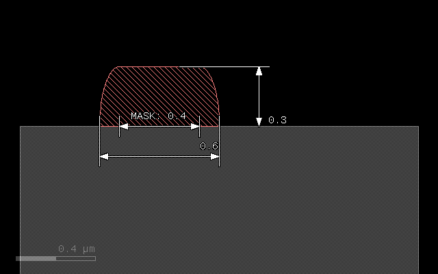
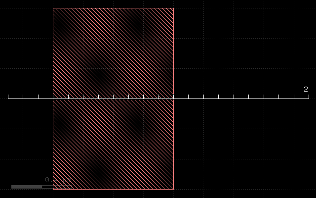
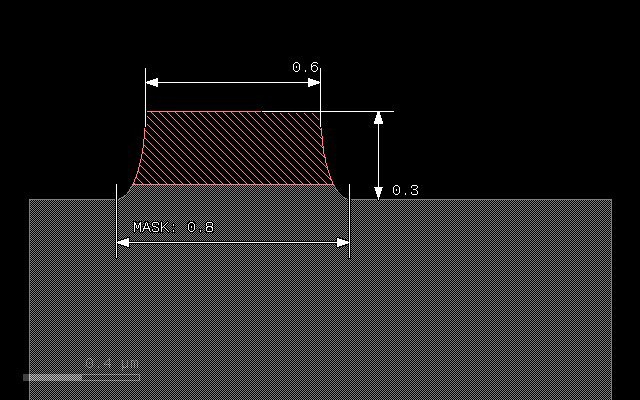
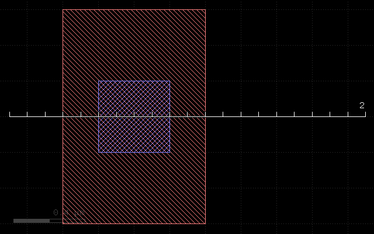
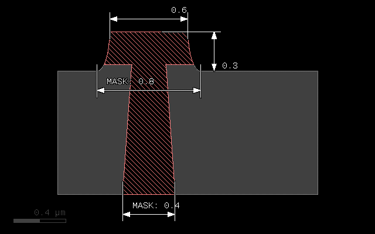

# Writing XS files - an introduction

Cross section files are simple to write. They provide a description how to convert a planar layout into a vertical material stack. XS scripts are really "scripts" - they are small programs which are executed by KLayout's internal Ruby interpreter. Simple scripts can be written without much knowledge of the Ruby language by following a simple recipe. Complex scripts can utilize the full power of that scheme by using loops, procedures, if statements and so on.

This document is an introduction into XS files. A reference with more details about the functions, methods and their parameters is provided here: [Reference](DocReference).

Let us start with a simple example for a XS file:

```ruby
# Prepare input layers
m1 = layer("1/0")

# "grow" metal on mask m1 with thickness 0.3 and lateral extension 0.1
# with elliptical edge contours
metal1 = mask(m1).grow(0.3, 0.1, :mode => :round)

# output the material data to the target layout
output("0/0", bulk)
output("1/0", metal1)
```

With the following input: 



This script will produce a simple cross section:



XS files are basically Ruby scripts, so the syntax rules for the Ruby language apply. Specifically:

* Comments start with a hash (#)
* Functions and methods should list their parameters in round brackets immediately after the function/method name without a blank (i.e. "method(p1, p2)", <b>not</b> "method (p1, p2)")
* Layers and materials are variables and should start with a lower case letter (variables starting with an upper case letter are regarded as constants by Ruby)
* Symbolic values start with a colon (i.e. ":mode", ":round")
* Some names are reserved and cannot be used as layer or material names, i.e. "begin", "end", "if", "while", "def", "class" etc.

XS files typically consist of three sections: the layer preparation step, the process description and the output section. 

In the layer preparation step, mask layers are computed from design layers. Often, mask data does not exactly correspond to design layers. Mask data can be derived from design layers by

* Sizing (shifting of the edges to the outside or inside of figures)
* Boolean operations between two design layers (AND, OR, NOT, XOR)
* Inversion of a layer

The design layer to mask conversion still happens in the xy plane, looking at the chip layout from above. Once the computation has been finished, the layout data now represents the mask data and is converted to a litho pattern by using the "mask" function.
In our example, no conversion takes place, and the input layer (layer 1, datatype 0) is directly taken to be mask data:

```ruby
mask(m1)
```

The mask function will basically create the cut along the ruler and prepare the mask to become a "seed" for subsequent grow and etch operations. Note that using a mask seed is not mandatory. There are also maskless operations (uniform deposit, epitaxy or planarization steps) which do not require mask data. 

In this example, there is just a single, mask-driven deposition step which is performed on that mask. It uses the "grow" method which is applied to the litho pattern object using the "." notation:

```ruby 
metal1 = mask(m1).grow(0.3, 0.1, :mode => :round)
```

"grow" is the method and the result of this is a "material" object. In that case, we specify an "overgrow" with an elliptical profile. The first argument of the grow method is the thickness of the deposited material in micrometers. The second argument is the lateral extension (diffusion) in micrometer units. ":mode => :round" is an option (a named argument in Ruby) which specifies round or elliptical mode. In the end, this specification will widen the original line of 0.4 micrometers to 0.6 micrometers, because it will add 0.1 micrometers to each side and produce a sheet thickness of 0.3 micrometers.

The grow method is one of the two basic methods for the process description. It can not only grow some material atop of the current stack but also convert material below the surface to another material. Find more about this method here: [Grow Method](DocGrow)

A material object can be used later as a target of etch processes for example. In our case, we simply output the material to an arbitrary output layer (here layer 1, datatype 0):

```ruby
output("0/0", bulk)
output("1/0", metal1)
```

"bulk" is a pseudo-material which denotes the substrate. It is written to layer 0, datatype 0 for illustration. In the screenshot, the metal1 material has been colored light red, the bulk material is colored gray.

## Variables and notation

The above form of the script is not mandatory. "m1" and "metal1" are variables which carry certain information. It is not required to store this information in variables, except if the information is to be reused in other places. Hence the computation of the metal1 output can be reduced to:

```ruby
output("1/0", mask(layer("1/0")).grow(0.3, 0.1, :mode => :round))
```
 
But obviously readability suffers, so the expanded notation used before is recommended. But this example illustrates that there is no magic behind the material names - they're just variables carrying certain information. For the interested readers: Ruby objects of various kinds representing layout data or material data.

## Input preparation

As stated before, input data can be combined to produce mask data. XS scripts use Ruby methods on layout data objects to implement these operations:

```ruby
l1 = layer("1/0")
l2 = layer("2/0")
# Boolean NOT between layer 1, datatype 0 and layer 2, datatype 0
p = l1.not(l2)
```

The same can be written more compactly if required. But again, readability suffers:

```ruby
p = layer("1/0").not(layer("2/0"))
```

Other Boolean operations available are:

```ruby
l1 = layer("1/0")
l2 = layer("2/0")
# Boolean OR between layer 1, datatype 0 and layer 2, datatype 0:
p1 = l1.or(l2)
# Boolean AND between layer 1, datatype 0 and layer 2, datatype 0:
p2 = l1.and(l2)
# Boolean XOR between layer 1, datatype 0 and layer 2, datatype 0:
p3 = l1.xor(l2)
```

Layers can be sized (biased). Sizing will shift the edges by the specified value in micrometer units. Positive values will shift the edges to the outside of the figures, negative values to the inside. Hence a positive value with increase the width of a line by twice that value, a negative value will reduce the width by twice the value. Negative values may make figures vanish fully or partially, positive values may remove holes or gaps in the layout. 

Sizing is available in two flavors: a modifying (in-place) version and version delivering a sized copy (out-of-place). Both methods accept one or two values. If one value is given, the bias will be applied in x and y direction, with two values, the first bias will be applied in horizontal direction, the other one in vertical direction.

```ruby
l1 = layer("1/0")
# p will be a copy of layer 1, datatype 0, sized by 0.2 micrometers:
p = l1.sized(0.2) 
# this will modify l1 by sizing it with a value of 0.1 in x direction only:
l1.size(0.1, 0)
```

Layers can be inverted. Again there is a in-place and out-of-place version of that method:

```ruby
l1 = layer("1/0")
# Inverts the layer (modifies l1):
l1.invert 
# Returns an inverted copy (which is identical with layer 1, datatype 0 again):
p = l1.inverted
```

### Caveat: Ruby and object references

When assigning something to another variable it is easy to make a common mistake:
when Ruby assigns something to another variable, it will (except for basic types) 
create another <b>reference</b> to the object, not a copy. That has a strange
consequence:

```ruby
a = layer("1/0")
b = a
# this will invert "b" too, since b is the same object than a:
a.invert
```

To create a real copy, either use the out-of-place methods or use the "dup"
method which creates a copy:

```ruby
# Solution 1:
b = layer("1/0")
a = b.inverted

# Solution 2:
a = layer("1/0")
b = a.dup
a.invert
```

### Material data is layout data too

Material data derived from deposition methods is layout data too, although not related to design layers. That allows to apply boolean operations and sizing to material data as well:

```ruby
l1 = layer("1/0")
l2 = layer("2/0")

metal1a = mask(l1).grow(0.1, 0.1, :mode => :round)
metal1b = mask(l2).grow(0.1, 0.1, :mode => :round)

output("1/0", metal1a.or(metal1b))
```

## Etch operations

The next sample script demonstrates the etch operation and mask-less deposit methods. It is closer to a real process, which does not use "mask-driven" grow but rather deposition and etch. It uses a layer inversion to turn the polarity of the mask: etching has to happen where no structure is drawn in order to produce the structure where it was drawn.

```ruby
# Prepare input layers
m1 = layer("1/0")
m1i = m1.inverted

# deposit metal with width 0.25 micron
metal1 = deposit(0.25)

substrate = bulk

# etch metal on mask m1 with thickness 0.3 and lateral extension 0.1
# with elliptical edge contours
mask(m1i).etch(0.3, 0.1, :mode => :round, :into => [ metal1, substrate ])

# output the material data to the target layout
output("0/0", substrate)
output("1/0", metal1)
```

With the following input: 



This script will produce the following cross section:



The layer preparation step performs the inversion using the "inverted" method:

```ruby
m1 = layer("1/0")
m1i = m1.inverted
```

"m1i" will be the inverted m1 mask and will be used as the "seed" for the etch.

Because we etch into the substrate we have to provide substrate as a material too. 
This is achieved with the following assignment:

```ruby
substrate = bulk
```

"bulk" is a pseudo-material describing the wafer substrate. Initially it is the
wafer material below the surface. "bulk" is read-only (in fact, "bulk" is a function), so we have to create a material we can modify by storing the material data object in a variable we call "substrate".

The etch step will now start from the inverted metal1 mask. Etch depth will be 0.3 micrometers, and we specify an underetch of 0.1 micrometers with elliptical profile. For the etch method we have to specify the material our etch process will remove. There is no differentiation in etch rate for these materials - they are assumed to behave the same way. Materials not listed will effectively form an etch stop. 

The materials the etch method will remove are listed with the ":into" parameter. This named parameter is mandatory for the etch method. The argument of that parameter is a material object or an array of objects, if multiple materials are to be removed. Arrays are fomed by enclosing the list in square brackets:

```ruby
mask(m1i).etch(0.3, 0.1, :mode => :round, :into => [ metal1, substrate ])
```

Because we etch deeper (0.3) than the sheet we have deposited before (0.25), we will remove a little bit of substrate as well. Note also, that we reduce the line with from 0.8 (drawn) to 0.6 at the top edge of the metal line. This bias will typically be compensated by a sizing operation when the mask data is prepared in a real process. 

Find details about the "etch" method here: [Etch Method](DocEtch)

## Backside processing

The last sample script demonstrates combinations of process steps and backside processing. Here is the script:

```ruby
# Specify wafer thickness
depth(1)

# Prepare input layers
m1 = layer("1/0").inverted
m2 = layer("2/0")

# deposit metal with width 0.25 micron
metal1 = deposit(0.25)

substrate = bulk

# etch metal on mask m1 with thickness 0.3 and lateral extension 0.1
# with elliptical edge contours
mask(m1).etch(0.3, 0.1, :mode => :round, :into => [ metal1, substrate ])

# process from the backside
flip

# backside etch, taper angle 4 degree
mask(m2).etch(1, :taper => 4, :into => substrate)

# fill with metal and polish
metal2 = deposit(1.1)
planarize(:downto => substrate, :into => metal2)

# output the material data to the target layout
output("0/0", substrate)
output("1/0", metal1.or(metal2))
```

With the following input: 



This script will produce the following cross section:



The topside processing part is the same than the previous sample and produces a metal structure at the top of the wafer. For backside processing, it is important to specify the wafer thickness. For illustration we use an unreasonably small value of 1 micrometer:

```ruby
depth(1)
```

The interesting part starts with this line:

```ruby
flip
```

This will basically turn the wafer and processing now happens from the backside. You can flip again to return to top side processing. We use a sequence of operations to create a filled through-silicon via:

```ruby
# backside etch, taper angle 4 degree
mask(m2).etch(1, :taper => 4, :into => substrate)

# fill with metal and polish
metal2 = deposit(0.3, 0.3, :mode => :square)
planarize(:downto => substrate, :into => metal2)
```

The etch step is configured to produce a tapered hole with a taper angle of 4 degree. The initial (now bottom) dimension of the hole is defined by the m2 mask which is shown in blue color in the layout and the structure has a dimension of 0.4 micrometers. 

After the hole has been etched, we deposit a metal layer thick enough to fill the hole. 0.3 micrometer layer thickness is sufficient. The deposition will cover the side walls of the hole and fill the hole completely. Square mode is creating a square profile which is not realistic, but computationally simple. 

The deposition will also create metal at the bottom side of the wafer which we polish away with a planarization step. The planarization step is similar to a maskless etch, but it will remove the specified material down to a certain depth. This stop condition is defined either by a planarization stop material (here: substrate) or by a threshold value.

On output we merge both metal types (front and backside deposited material) to form a joined metal structure:

```ruby
output("1/0", metal1.or(metal2))
```

